# Generative AI for Spatial Data

## Overview
This repository is dedicated to the seminar presentation **"Generative AI for Spatial Data"** presented by **Rajdip Ingale**, 1st year M.Tech student at  IIT Bombay.
The seminar focuses on the evolution, applications, and potential of Generative AI for geospatial data processing, with an emphasis on developing a fine-tuned generative foundation model for flood mapping in India.

The seminar highlights:
- The evolution of Generative AI and its applications.
- Identification of research gaps and challenges in generative AI for geospatial applications.
- The architecture and capabilities of foundation models like PRESTO, SatMAE, and PRITHVI.
- A proposed fine-tuned foundation model for flood mapping in India.

---

## Table of Contents
1. [Introduction](#introduction)
2. [Generative AI vs. Discriminative AI](#generative-ai-vs-discriminative-ai)
3. [Evolution of Generative AI](#evolution-of-generative-ai)
4. [Applications of Generative AI in Geospatial Data](#applications-of-generative-ai-in-geospatial-data)
5. [Objectives of the Seminar](#objectives-of-the-seminar)
6. [Literature Review](#literature-review)
7. [Limitations of Existing Foundation Models](#limitations-of-existing-foundation-models)
8. [Proposed Methodology](#proposed-methodology)
9. [Summary](#summary)
10. [References](#references)

---

## Introduction
Generative AI is an innovative approach in artificial intelligence that focuses on learning the underlying distribution of data to create new, synthetic instances. This seminar explores how generative AI bridges the gaps in geospatial data, especially in applications like flood mapping and satellite image synthesis.

---

## Generative AI vs. Discriminative AI
- **Discriminative AI**:
  - Learns to predict the probability of a class given input data (P(Y|X)).
  - Example: Classifying flood-affected areas.

- **Generative AI**:
  - Models the joint probability (P(X, Y)) to understand the data distribution and generate synthetic samples.
  - Example: Generating satellite imagery of hypothetical flood scenarios.

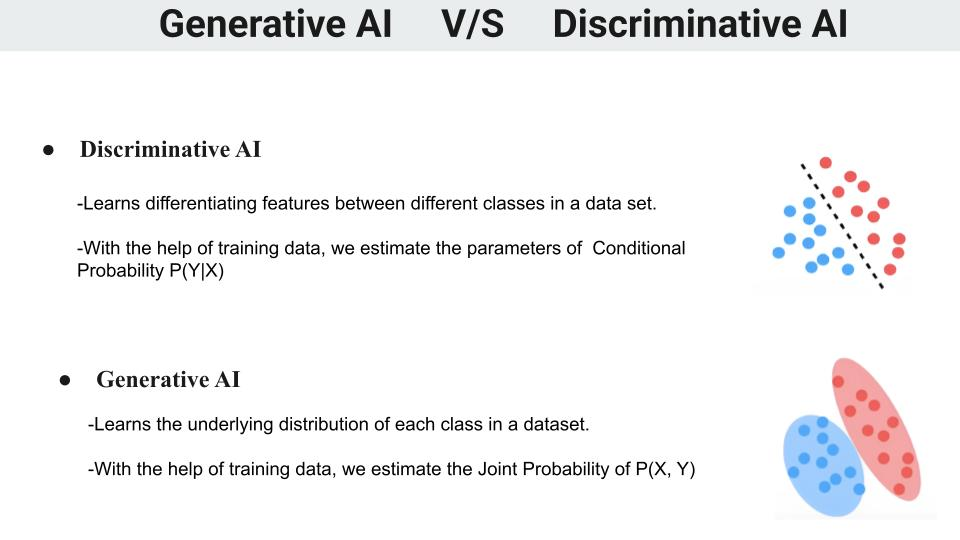

---

## Evolution of Generative AI
The timeline of generative AI shows significant advancements from 2014 to 2023, with the emergence of foundation models and innovative architectures.

 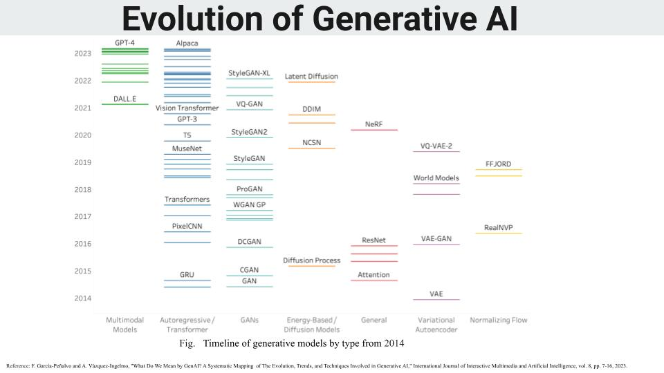

---

## Applications of Generative AI in Geospatial Data
Key geospatial applications include:
- **Data Augmentation**: Filling data gaps by generating synthetic samples.
- **Scenario Forecasting**: Simulating flood impacts under different climate scenarios.
- **Map Creation and Enhancement**: Generating realistic maps for planning and visualization.
- **Data Restoration**: Reconstructing missing or corrupted satellite data.

---

## Objectives of the Seminar
The seminar aims to:
1. Explore the evolution of Generative AI and its underlying methodologies.
2. Review foundational geospatial AI models such as PRESTO, SatMAE, and PRITHVI.
3. Highlight challenges in applying generative AI to geospatial data.
4. Propose a fine-tuned generative AI model for flood mapping in India.

---

## Literature Review
### Foundation Models
1. Taxonomy and architecture of foundation models.
2. Opportunities and risks of these models in geospatial applications.
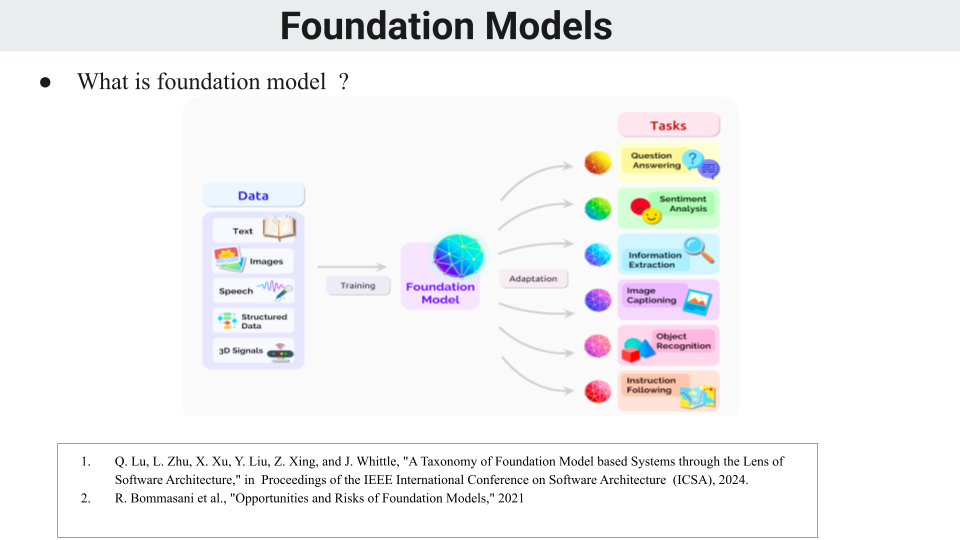

#### SOTA Geospatial foundation models:
1. **PRESTO**:
   - Lightweight transformer-based model for remote sensing timeseries.
   - Focused on temporal data.
 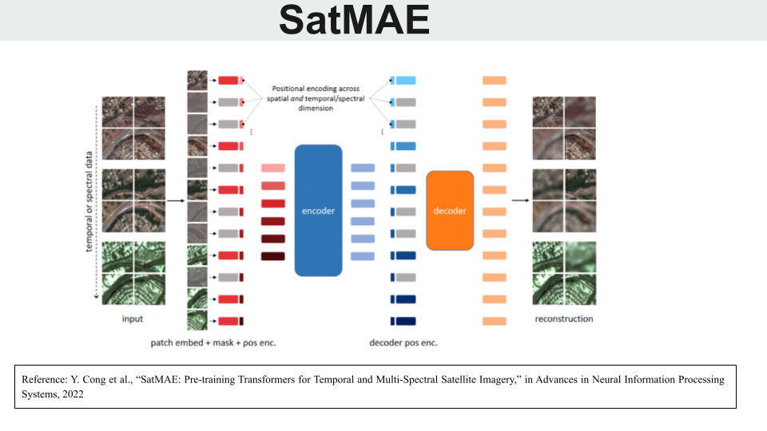
2. **SatMAE**:
   - Multi-spectral satellite imagery pre-training model.
   - Utilizes self-supervised learning for data efficiency.

 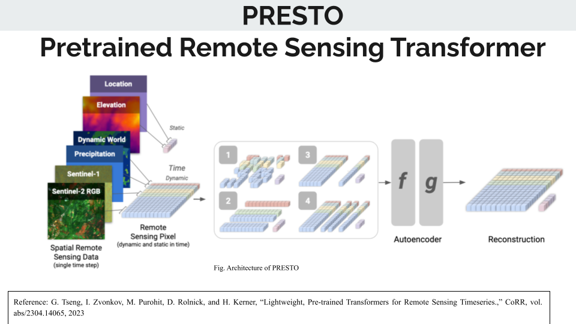
3. **PRITHVI**:
   - Generalist geospatial AI model.
   - Capable of handling diverse spatial datasets.
     
 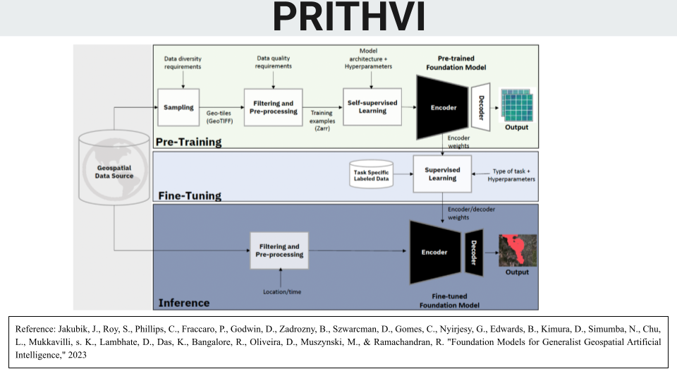

---

## Limitations of Existing Foundation Models
Identified challenges include:
1. **Geographic Fidelity**: Errors in location predictions and misinterpretation of text and geospatial semantics.     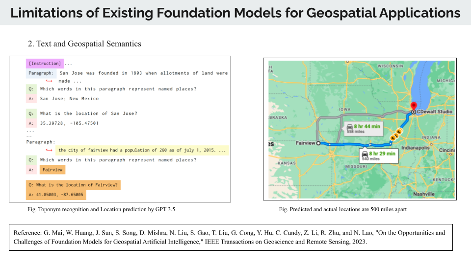 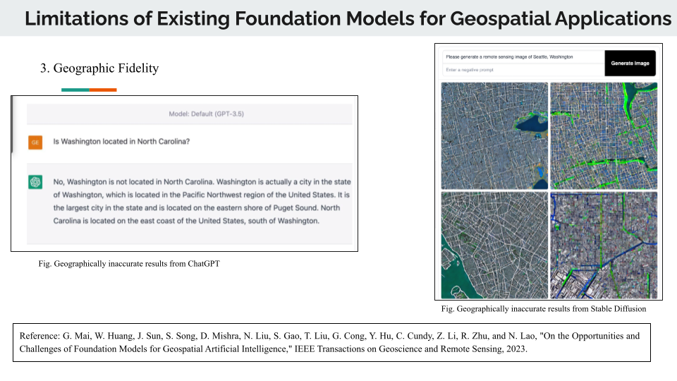

2. **Geographic and Temporal Bias**: Systematic errors in predictions due to biases in training data.           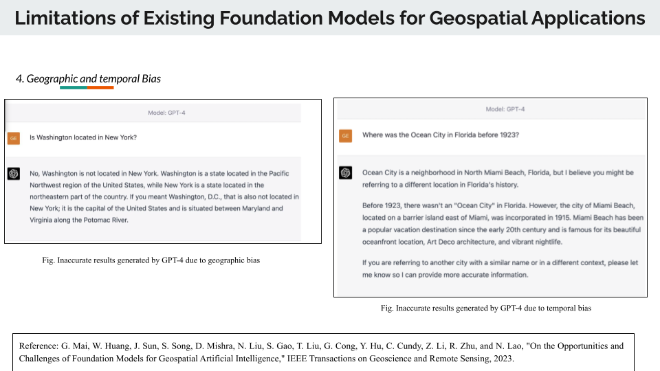
3. **Error in handling Spatial SQL Queries**:  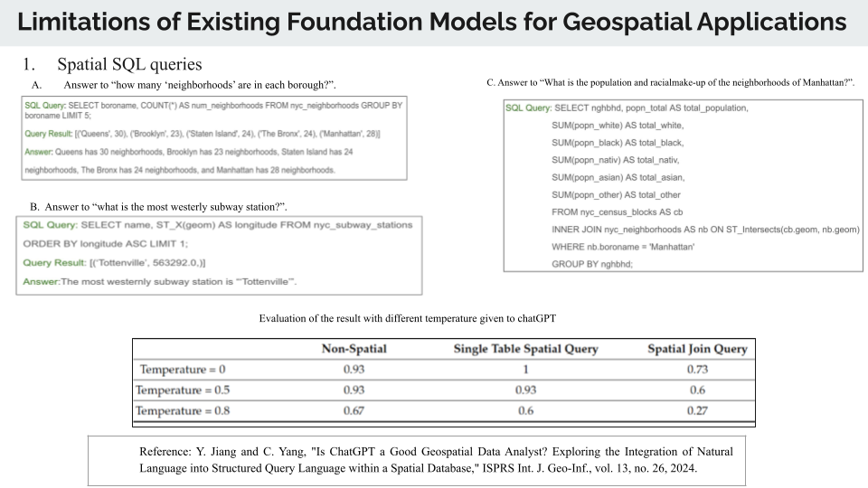

_Image Placeholder: Limitations Slide_

---

## Proposed Methodology
### Geospatial Foundation Model for Flood Mapping
- Combines supervised and self-supervised learning approaches.
- Fine-tuned for Indian flood mapping scenarios.

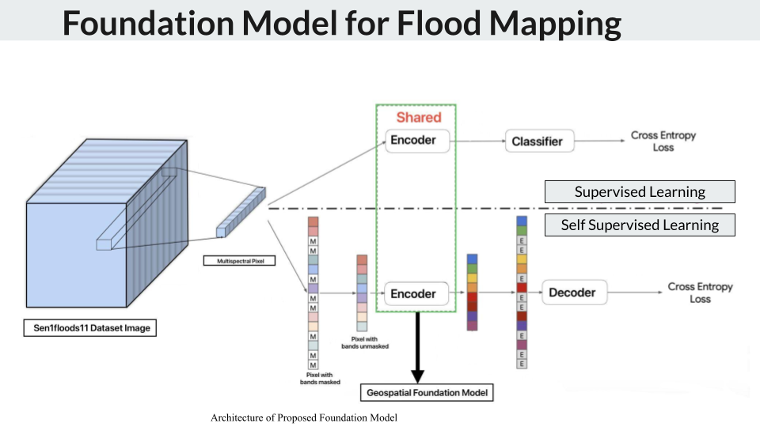

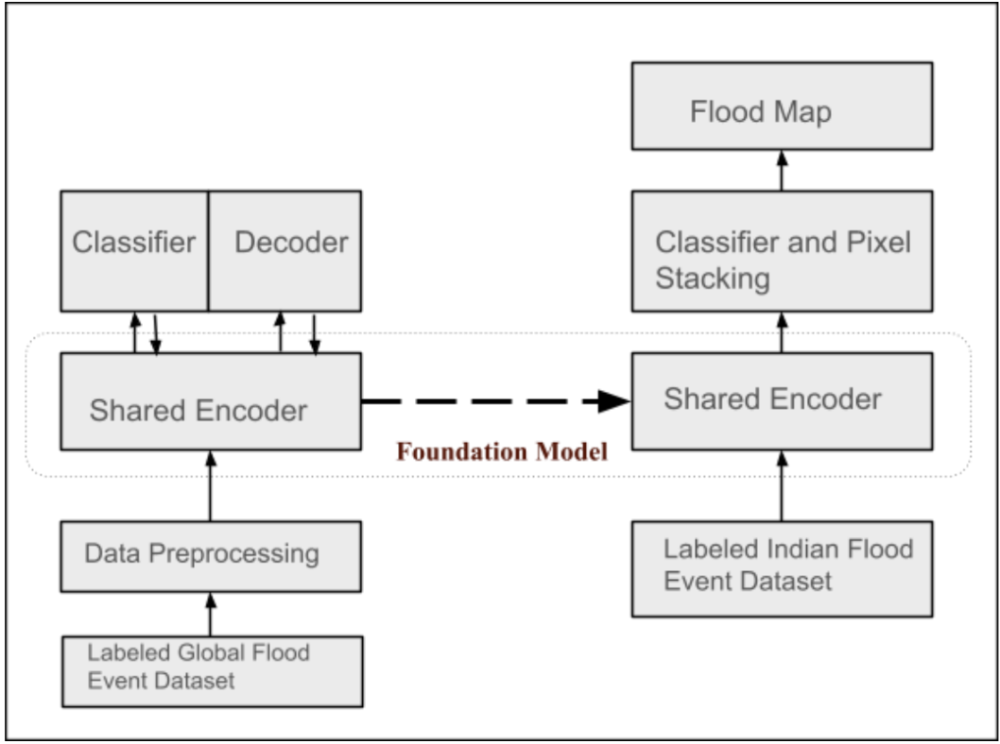

#### Key Features:
1. Handles missing geospatial data efficiently.
2. Leverages temporal and spectral encoding.
3. Adapts to diverse geospatial datasets and inputs.

---

## Summary
This seminar:
1. The transformative potential of Generative AI for geospatial data processing.
2. Existing foundation models and their limitations.
3. A novel architecture for fine-tuned flood mapping in India.
4. The future scope of Generative AI in addressing challenges like data scarcity and geographic bias.

---

## References
1. García-Peñalvo and Vázquez-Ingelmo, "What Do We Mean by GenAI? A Systematic Mapping of The Evolution, Trends, and Techniques," IJIMAI, 2023.
2. Cong et al., "SatMAE: Pre-training Transformers for Temporal and Multi-Spectral Satellite Imagery," NeurIPS, 2022.
3. Tseng et al., "PRESTO: Lightweight, Pre-trained Transformers for Remote Sensing Timeseries," 2023.
4. Jakubik et al., "Foundation Models for Generalist Geospatial Artificial Intelligence," 2023.

---
